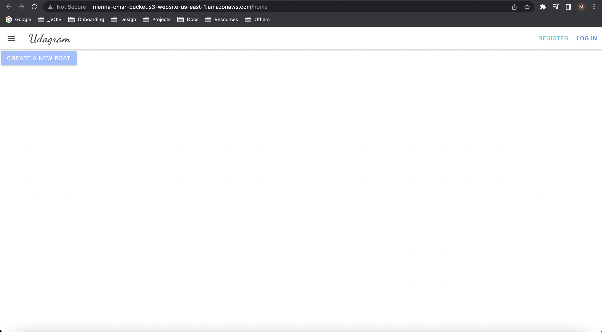

## App links

- Client URL => http://menna-omar-bucket.s3-website-us-east-1.amazonaws.com

- API URL => http://udagram-api-dev.eba-s3s4e3pj.us-east-1.elasticbeanstalk.com/api/v0

## Create Bucket
aws s3api create-bucket --bucket menna-omar-bucket --region us-east-1

## AWS
- Create IAM user with `AdministratorAccess`

- Configure the aws cli user with your terminal via `aws configure`

## CIRCLE/CI Environments
- AWS_BUCKET=$AWS_BUCKET
- AWS_REGION=$AWS_REGION
- DB_PORT=$DB_PORT
- JWT_SECRET=$JWT_SECRET
- PORT=$PORT
- POSTGRES_DB=$POSTGRES_DB
- POSTGRES_HOST=$POSTGRES_HOST
- POSTGRES_PASSWORD=$POSTGRES_PASSWORD
- POSTGRES_USERNAME=$POSTGRES_USERNAME
- URL=$URL

## Project needs to run such as RDS, elasticbeanstalk and s3

- Init Elastic Beanstalk
- eb init udagram-api --platform node.js --region us-east-1

- Create Sample
- eb create --sample udagram-api-dev

## Run Application
### install frontend
- $ npm run frontend:install
### install backend
- $ npm run backend:install
### build frontend
- $ npm run frontend:build
### build backend
- $ npm run backend:build
### test frontend
- $ npm run frontend:test
### test backend
- $ npm run backend:test
### deploy frontend
### deploy backend
- $ npm run backend:deploy

## Diagrams
### Infrastructure Diagram

### Pipeline Diagram

### What services (from AWS) your project needs to run?
- RDS
- S3
- Elastic Beanstalk
- CircleCI

### What modules are your app depending on?
- Node.js
- postgres
- aws
- npm

### Pipeline process
1. push code in github
2. login in circleci
3. set env in circleci
4. set branch which deploy changes in app
5. once you push in specific branch changes will be deployed

## Git links

- Client => https://github.com/MennaMoOmar/udacity-udagram-frontend
- API => https://github.com/MennaMoOmar/udacity-udagram-api
- Full Version => https://github.com/MennaMoOmar/udacity-udagram-full

## Images

